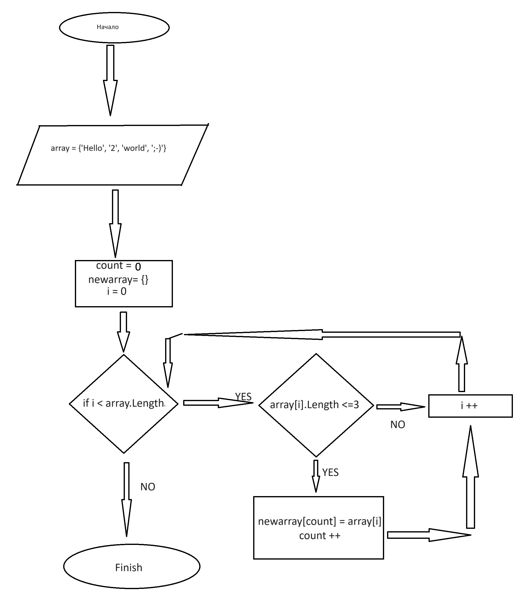

# Решение итоговой аттестации

*Написать программу, которая из имеющегося массива строк формирует новый массив из строк, длина которых меньше, либо равна 3 символам. Первоначальный массив можно ввести с клавиатуры, либо задать на старте выполнения алгоритма. При решении не рекомендуется пользоваться коллекциями, лучше обойтись исключительно массивами.*

>**Примеры:**
>
>[“Hello”, “2”, “world”, “:-)”] → [“2”, “:-)”]
>
>[“1234”, “1567”, “-2”, “computer science”] → [“-2”]
>
>[“Russia”, “Denmark”, “Kazan”] → []

## Ход решения
1. Создадим два массива, один с исходными данными, второй - пустой.
2. Создадим переменную счетчик.
3. Напишем цикл For, который перебирает строки в массиве с вложенным условием по количеству символов в строке.
4. Если условие выполнено, присваиваем элементу пустого массива значение i элемента исходного массива.
5. Затем создаем функцию вывода массива.
6. Применяем функцию к новому массиву.

**Блок-схема**
